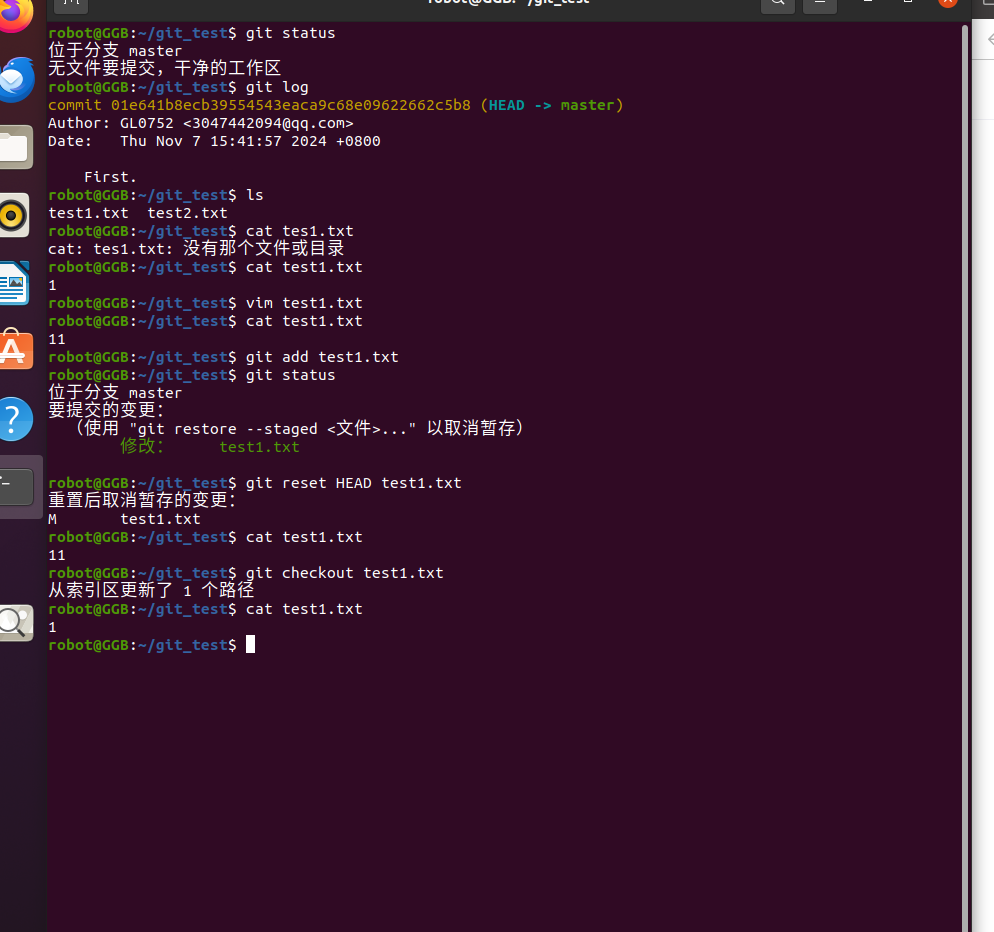
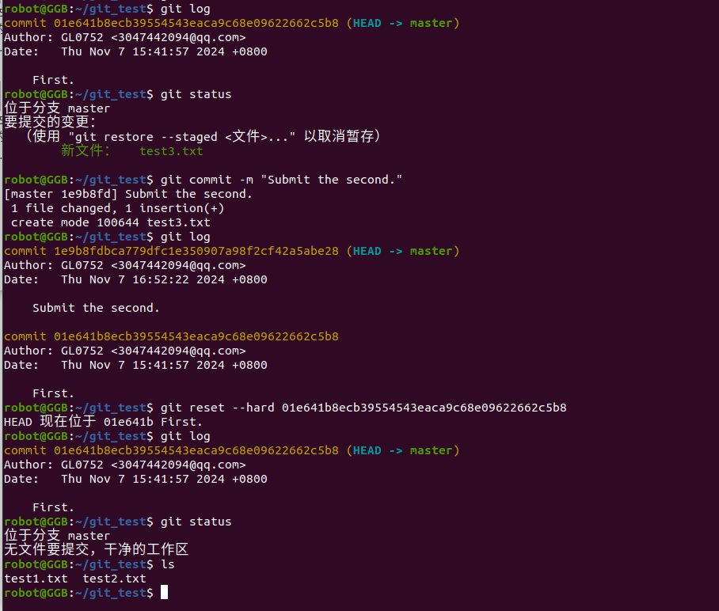
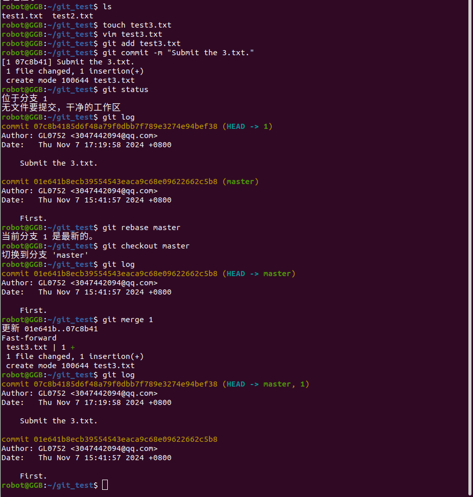

# ***Git应用***

**1.** 方式一：使用git reset --hard HEAD 把工作区和暂存区都恢复到最后一次提交的状态，所有未提交的修改都会被丢弃。由于--hard参数会强制覆盖工作区的修改，使用时需考虑考虑。

方式二：使用git checkout -- <文件名> 这将把指定文件恢复到最后一次提交的状态。

**2.** 不修改历史记录：git reset --soft <commit_hash> 将 HEAD 指针移动到指定的提交，但是不会更改工作目录和暂存区的内容。

修改历史记录：git reset --hard <commit_hash>：将 HEAD 指针移动到指定的提交，并重置工作目录和暂存区，使其与指定提交的状态完全一致。这会完全丢弃从指定提交之后的所有更改，并且无法恢复。

**3.** 方式一：使用rebase命令，将一系列提交从一个分支上“复制”并“粘贴”到另一个分支上。

git checkout feature-branch

git rebase master

git checkout master

git merge feature-branch

方式二：使用 cherry-pick`命令合并特定提交，将某个分支上的特定提交合并到其他分支。

git checkout master

git cherry-pick <commit-hash>

