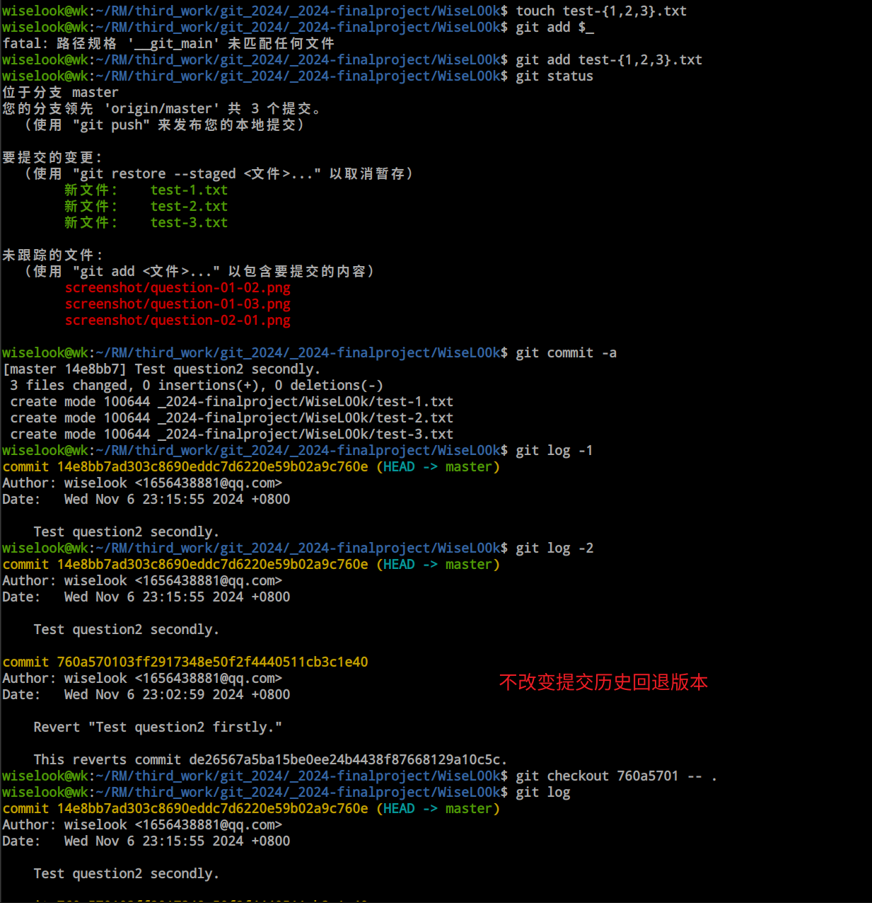
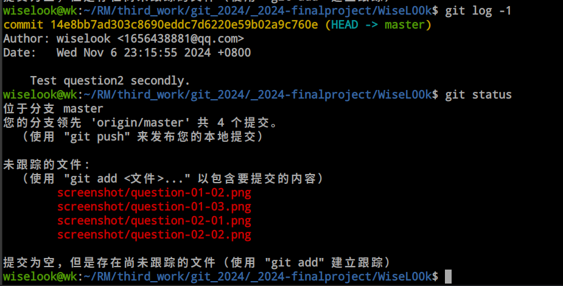

# Git应用

## 问题1

#### 1.若你已经修改了部分文件、并且将其中的一部分加入了暂存区，应该如何回退这些修改，恢复到修改前最后一次提交的状态？给出至少两种不同的方式

答：

1.可以使用 git reset --hard  \<commit\> 命令，其中commit版本号，可以通过 git log 命令查看。通过--hard参数，暂存区和工作区都将重置。commit用HEAD就行，因为还没有提交。此时HEAD指向的便是最新一次提交，即最后一次提交。


2.也可以执行 git restore --staged \<file1> 命令，撤回暂存区的更改。然后执行git restore . ,撤销所有工作区更改。PS：通过	.	符号通常都是指所有文件。


3.另外还可以使用 git checkout \<commit\> -- file1... , 将file1替换为要回退的文件即可。这样工作区便恢复成最后一次提交的状态。此外使用 git checkout -- .  可以恢复文件到最后一次提交时的状态，包括工作区和暂存区的修改都会被撤销。

## 问题2

#### 2.若你已经提交了一个新版本，需要回退该版本，应该如何操作？分别给出不修改历史或修改历史的至少两种不同的方式

答：

1-1.若要不修改历史，可以通过git revert命令，这条命令会创建一个新的提交，这个提交会撤销之前提交的内容。这样，历史记录仍然保持不变，只是增加了一个撤销提交。通过执行下面命令，便可以不修改历史回退版本。

```
git revert <新版本前一个版本的哈希值>
```


1-2.还可以使用 git checkout 命令，通过 git checkout <新版本前一个版本的哈希值> -- . ,也可以实现不修改历史回退版本。<新版本前一个版本的哈希值>可以通过git log查看





## 问题3

#### 3.我们已经知道了合并分支可以使用 merge，但这不是唯一的方法，给出至少两种不同的合并分支的方式

答：